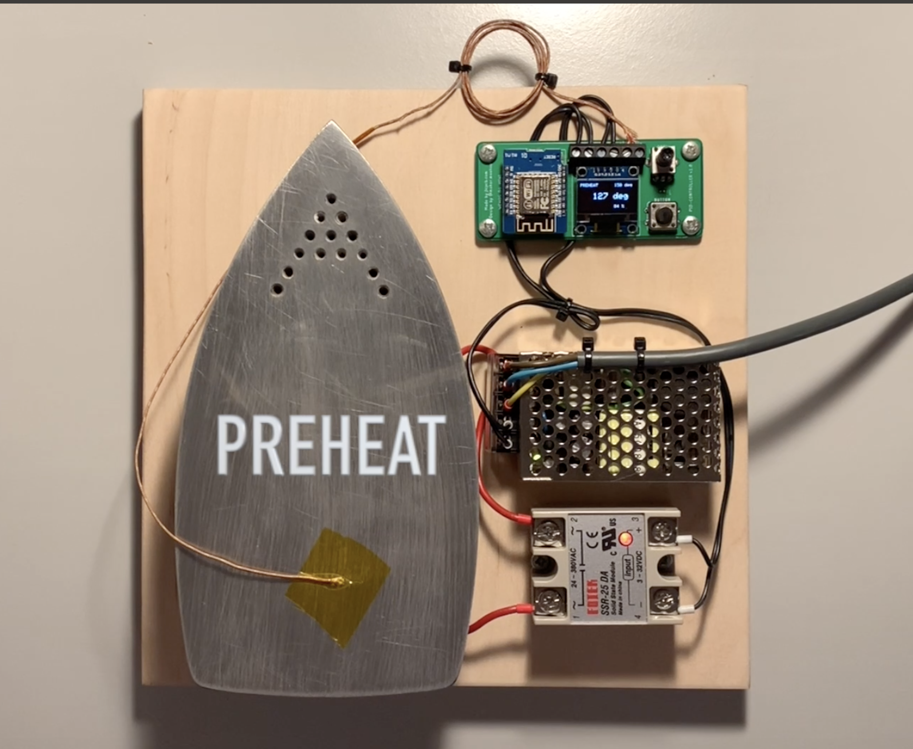
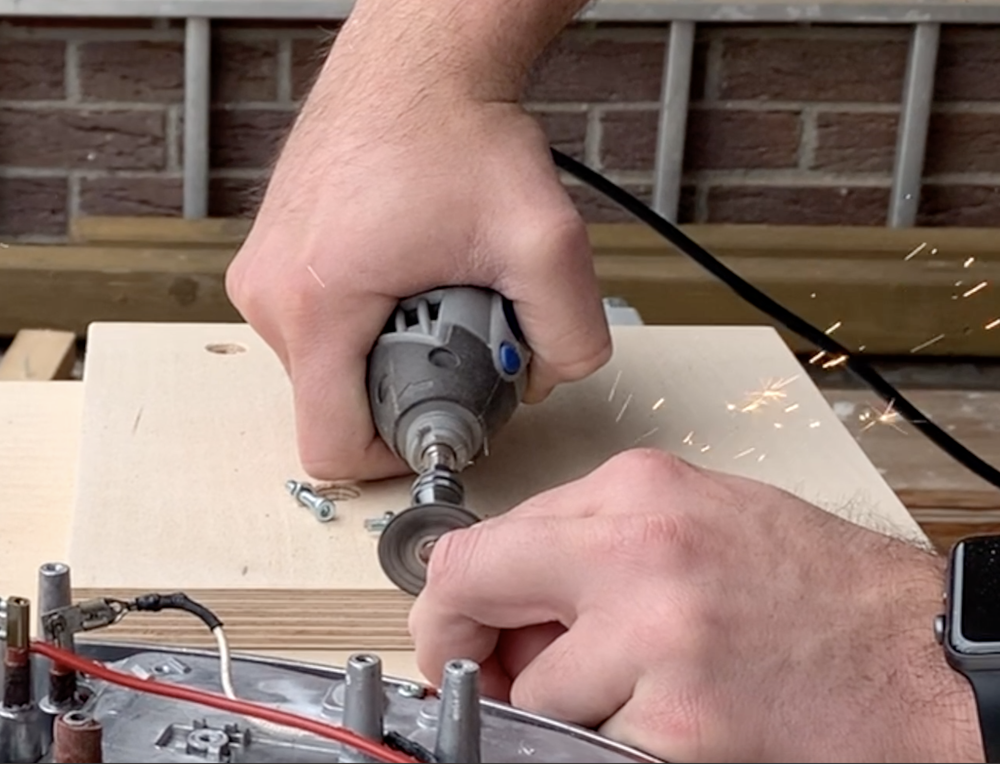

# Hotplate Soldering Iron

(New version)

(Old version)

(Click on the images for a small video.)

Basic idea of the hotplate is slightly different from the standard tools like a reflow oven or soldering irons. The heat is supplied from the bottom of the PCB.

__What you will need:__

- an old iron
- microcontroller (I used a wemos d1 mini, but any will work)
- solid state relay 25A
- thermocouple sensor (a fast one...)
- 182x64 pixels oled display
- 5V DC power supply
- button, potentiometer and wires
- piece of wood and screws

Something similar is the Reflow Skillet from SparkFun: https://www.sparkfun.com/tutorials/59. They tested several methods to solder SMD components to PCBs and it turns out that their Skillet is the best solution for makers with a small budget. Inspired by this, my first thoughts about this old flatiron I found in the garage were to build a similar hot plate thing for soldering. And it turns out that this is working like a charm.

Concept of this is that the wemos d1 mini controls the solid state relay based on temperature informations from the thermocouple sensor, which I placed with some heat resistant kapton tape directly onto the iron (actually the sensor should be placed onto the PCB for preciser temperature readings). If you have a really fast iron than maybe you should use something like a PID controller. For me and my very sluggish iron a normal threshold based control is enough for now. I added my simple threshold code to this repository.

It takes about 3 minutes for the whole soldering process, which is very fast, compared to some professional solutions like reflow ovens. Maximal temperature is something about 220-240 degrees, depending on several things like used solder paste, PCB thickness, ...

__Conclusion:__

__Pro__
- works like a charm
- very low cost (I found all components at home)
- very fast soldering
- simple to build
- small frame size, suitable in every maker lab

__Cons__
- works only for one side of a PCB
- sluggish heat control of the iron (cool down takes several minutes). The PCB has to be removed after soldering process to cool down.

## Build your own

I have published two videos for creating the peace of wood used as base plate and for connecting the wires to the pcb. Just click on the images below to start the videos.

When connecting the 230V power supply to your board be careful not to switch some wires, like I did :D

The three terminals are labeled with __SSR__ for solid state relay, __DC5V__ for the Wemos power supply and __Thermo__ for the thermocouple sensor. When switching the thermocouple sensor wires, the temperature on the display will get smaller when the plate gets hot. If this is the case, simply switch the __Thermo__ wires.

## Schematics

For the PCB I desoldered the MAX6675 thermocouple IC from the small breakout board and used it directly onto the PCB to safe a little bit of space. All other components are just connected via pin headers to the PCB. The 5V power supply, the thermocouple and the solid state relay on GPIO 8 are connected via those screw terminals.

## Printed Circuit Board

(Click on the image for a small video.)
