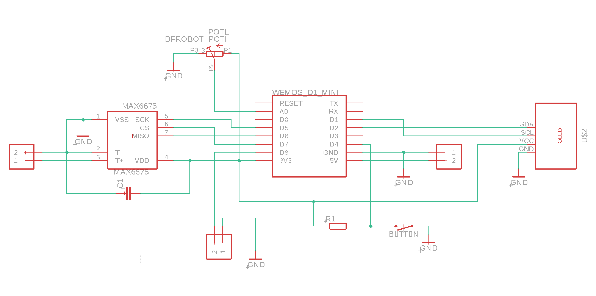
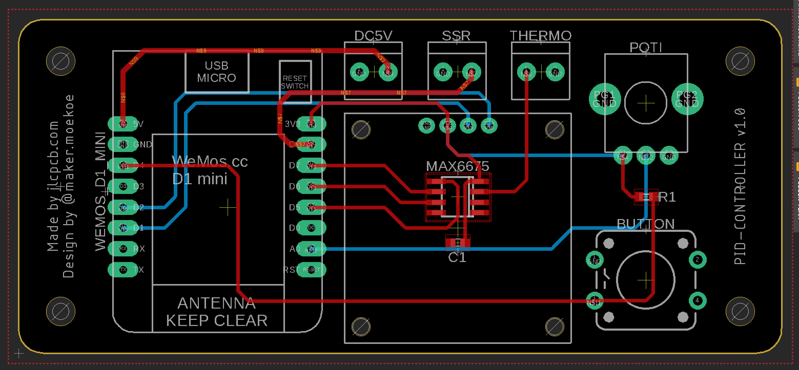

# Hotplate Soldering Iron

(Click on the image for a small video.)

Basic idea of the hotplate is slightly different from the standard tools like a reflow oven or soldering irons. The heat is supplied from the bottom of the PCB.

Something similar is the Reflow Skillet from SparkFun: https://www.sparkfun.com/tutorials/59. They tested several methods to solder SMD components to PCBs and it turns out that their Skillet is the best solution for makers with a small budget. Inspired by this, my first thoughts about this old flatiron I found in the garage were to build a similar hot plate thing for soldering. And it turns out that this is working like a charm.

It takes about 3 minutes for the whole soldering process, which is very fast, compared to some professional solutions like reflow ovens. Maximal temperature is something about 230-240 degrees.

__Conclusion:__

__Pro__
- works like a charm
- very low cost (I found all components at home)
- very fast soldering
- simple to build

__Cons__
- works only for one side of a PCB
- sluggish heat control of the iron (cool down takes several minutes)

## Schematics

For the PCB I desoldered the MAX6675 thermocouple IC from the small breakout board and used it directly onto the PCB to safe a little bit of space. All other components are just connected via pin headers to the PCB. The 5V power supply, the thermocouple and the solid state relay on GPIO 8 are connected via those screw terminals.

## Printed Circuit Board

